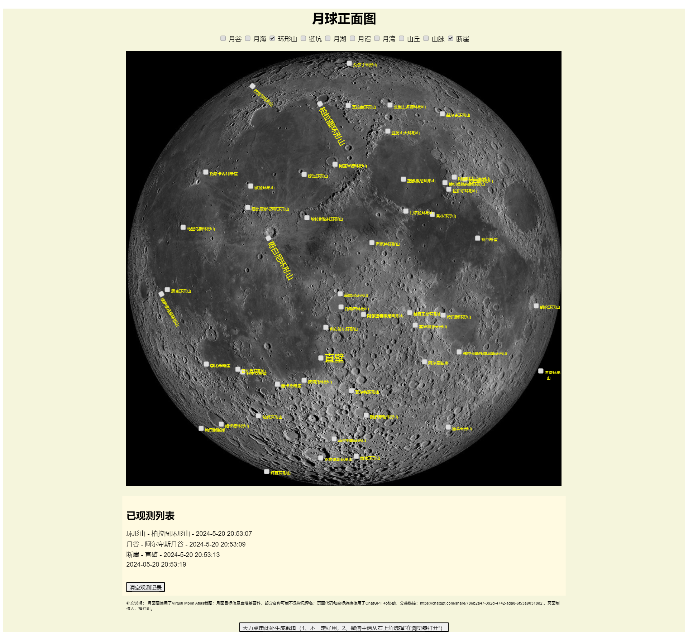

# MoonWatcher - 月球观看辅助工具

## Introduction 简介
我搞了一个月球观看辅助页面，它提供了按照不同类型浏览月海、环形山、月谷等目标的功能，还有记录临时观测、一键生成截图等功能，欢迎大家尝试。py文件是从月面目标csv文件生成页面代码的Python代码。

I created a lunar observation assistant page that allows users to browse lunar features such as mare, craters, and valleys by different types. It also provides functionalities for recording temporary observations and generating screenshots with a single click. Feel free to give it a try. The Python file generates the HTML page code from a CSV file containing lunar target data.

## Online Demo 在线演示
[https://www.feixingchuan.com/lunar/index.html](https://www.feixingchuan.com/lunar/index.html)

## Screenshot 截图

